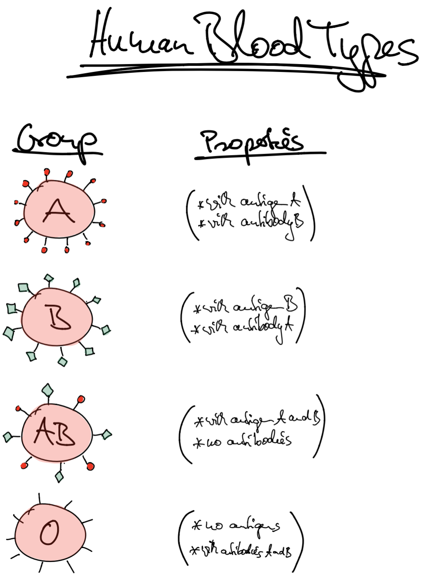
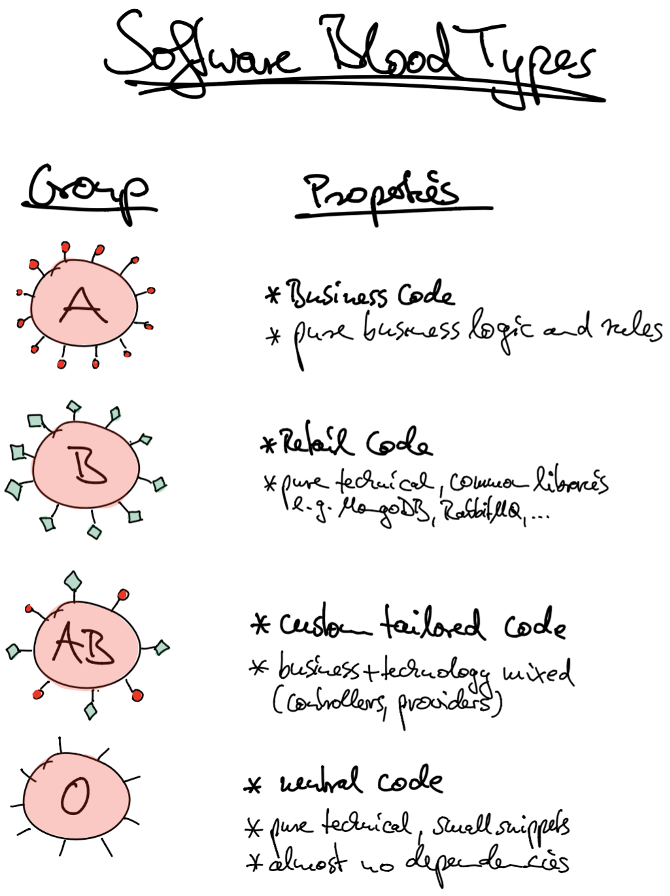

# Software Blood Types

## Human Blood Types

A blood type is a classification of blood, based on antibodies and antigens on the surface of red blood cells.
	
All humand beeings can be classified into 4 groups:

* group A: with antigen A
* group B: with antigen B
* group AB: with antigens A and B
* group 0: no antigens A and B

## Software Blood Types

Similar to human "blood types", software can also be categoriezed into 4 groups with different properties:

* group A: business code
* group B: technology code (retail code, commodity - comparable, available, common, off the shelves)
* group AB: business and technology mixed (tailored code, custom code)
* group 0: neutral code (universal)

## Original Concept

**Quasar Architectur - Capgemini**

* http://ps.informatik.uni-tuebingen.de/2015/01/14/talk-by-capgemini/
* https://github.com/klauso/SDPT2014/raw/master/lectures/07_Architektur_Quasar.pdf
