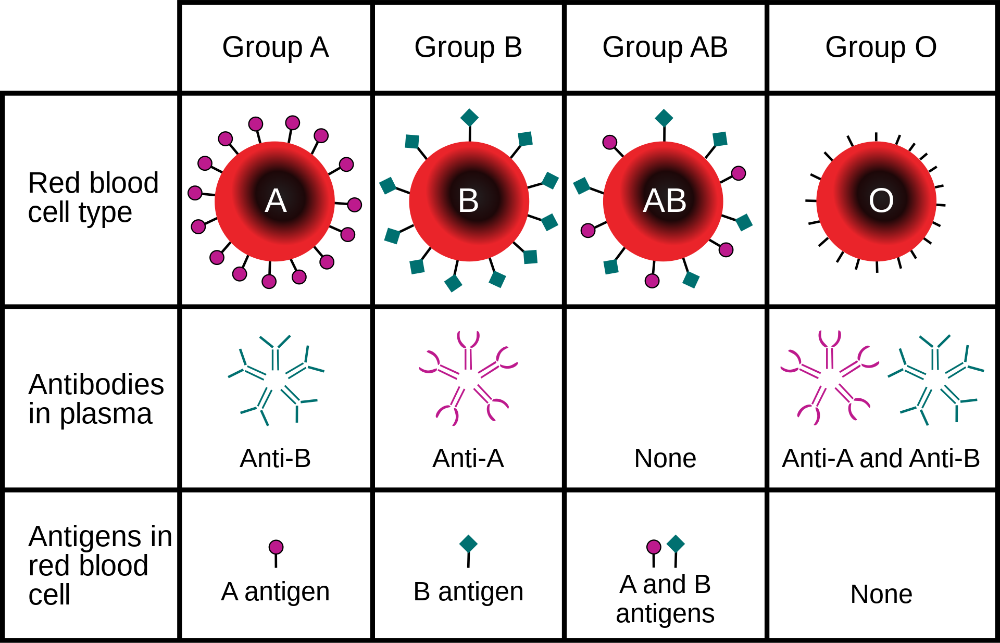

# Software Blood Types

## Human blood types, which are split into 4 categories:

Human Blood Types:
1) A
2) B
3) AB
4) 0

## We take this concept and apply it to software by defining the following 4 categories:

1) **A** - technical code (like DB queries, HTTP response headers, websockets code)
2) **B** - business domain code (classes like: customer, order, book, shopingCart)
3) **AB** - mixed code: technical code + business code
4) **0** - neutral code with no dependencies (utility functions like calculateHash(), formatTimestring(), downloadFile())

## Here are the benefits of structuring your software based on these categories:

* neutral code (**blood type 0**) can be easily shared across the company
* technical code (**blood type A**) can become an open source project to attract talent and receive bug fixes from the community
* business domain (**blood type B**) is the actual asset and the reason why we build the software in the first place (it creates business value)
* mixed code (**blood type AB**) this is your biggest liability, let it grow and see how it eats your time and money and becomes a big ugly spaghetti code monster :-)

